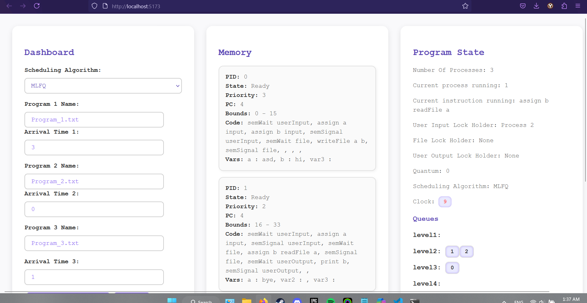

# OS Simulator & Visualizer 🖥️

A full-stack educational operating system simulator. Built in C with a React + TypeScript frontend, it visualizes key OS behaviors including scheduling, memory handling, and process state transitions.

---

## 🛠️ Tech Stack
- **Frontend:** React, TypeScript, Vite
- **Backend Logic:** C
- **Communication:** NodeJS (using `.cjs` bridge script)
- **Languages Used:** C, TypeScript, JavaScript

---

## 📦 Features
- 🧵 **Process Scheduling Algorithms**:
  - First-Come First-Serve (FCFS)
  - Round Robin (RR)
  - Multilevel Feedback Queue (MLFQ)
- 🧠 **State Management**:
  - Tracks Ready, Running, Blocked, and Terminated states
  - Displays current PC and memory usage
- 💾 **Memory Simulation**:
  - Allocates memory blocks to processes dynamically
- 🖼️ **Visual Interface**:
  - Interactive React UI with modular sections (State View, Memory View, Input)

---

## 🚀 How to Run

### Backend (C Logic)
1. Compile `scheduler_logic.c`:
   ```bash
   gcc scheduler_logic.c -o logic.out
   ```

2. Run the backend (if standalone test):
   ```bash
   ./logic.out
   ```

### Frontend (React App)
1. Navigate to the frontend folder:
   ```bash
   cd frontend_os
   ```

2. Install dependencies:
   ```bash
   npm install
   ```

3. Start the development server:
   ```bash
   npm run dev
   ```

4. Visit: [http://localhost:5173](http://localhost:5173)

> 🔄 The frontend communicates with the backend logic via `Ctranslator.cjs`, which acts as a bridge script.

---

## 📂 Project Structure

```
OS_Simulator/
├── scheduler_logic.c           # Core OS logic (in C)
├── frontend_os/
│   ├── src/
│   │   ├── App.tsx             # Main React App
│   │   ├── logic/              # Text files + translator bridge
│   ├── public/
│   └── package.json
└── Program_X.txt               # Sample input programs
```

---

## 🧪 Sample Scenarios
- ⚙️ Load programs via `.txt` files
- 🧮 See memory segments allocated live
- 🔄 Simulate different scheduling techniques and compare behavior

---

## 📸 Screenshots

### 🎬 Watch the Demo
[](https://drive.google.com/file/d/1AUzeNbBK_san6WT4RwhZygrWLEYfaFFf/view?usp=drive_link)

---

## 🧑‍💻 Team
Developed by Team 48 – German University in Cairo (Spring 2025)
